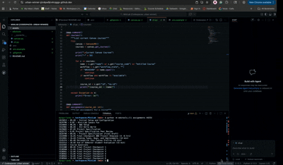

# MiniLab: Canvas CLI Tool

**Author:** Andy Lopez-Martinez  
**Class:** CS408  
**Semester:** Spring 2026

## Overview

This project implements a command-line interface (CLI) tool that interacts with the Canvas Learning Management System API. The tool allows a user to list their active Canvas courses and view assignments for a selected course directly from the terminal. The program authenticates using a Canvas API token stored in a `.env` file and formats the results in a readable way for terminal output.

## Demo



The GIF above demonstrates the CLI tool listing courses and then displaying assignments for a selected course.

## Reflection

Working on this project helped me understand how to interact with a real-world REST API using Python. I learned how to authenticate requests using an API token, send HTTP requests with the `requests` library, and process JSON responses returned from the Canvas API. It was interesting to see how a simple command-line interface can be used to access data from a larger system like Canvas.

One challenge I ran into was getting authentication to work correctly and debugging issues related to invalid API tokens. I also had to learn how Canvas paginates its results and implement logic to retrieve multiple pages of data. If I had more time, I would improve the tool by adding additional commands such as displaying assignment due dates, sorting assignments by due date, or showing announcements and TODO items from Canvas.

## Compiling and Using
### 1. Clone the repository
```
git clone https://github.com/yagurlandy/MiniLab.git
cd MiniLab
```
### 2. Install dependencies
```
pip install requests typer python-dotenv
```
### 3. Create a `.env` file

**Create a file named `.env` in the project root and add Canvas API token:**
```
CANVAS_API_TOKEN=your_token_here
```

**You can generate this token in Canvas under:**

***Account Settings → Approved Integrations → New Access Token***

### 4. Run the CLI tool

**List current Canvas courses:**

```
python -m edutools.cli courses
```

**Example output:**
```
Current Canvas Courses
--------------------------------------------------
44253 - Sp26 - CS 408 - Full Stack Web Development
46024 - Sp26 - ECE 330 - Microprocessors
```

**List assignments for a specific course:**
```
python -m edutools.cli assignments 44253
```

**Example output:**
```
Assignments for Course 44253
--------------------------------------------------
1531484 - 01.02 Syllabus Quiz (15 - 30 min)
1531486 - 01.03 Class Introductions (30 min - 1 hr)
1534844 - 06.01 - AWS Setup
```

**The tool accepts the `course_id` as a command-line argument to retrieve assignments for that course.**

## Results

The CLI tool successfully connects to the Canvas API and retrieves course and assignment data using authenticated requests. The output is formatted in a human-readable format instead of raw JSON. The program also handles errors gracefully by catching exceptions and printing a helpful error message if the API token is missing, invalid, or if the network request fails.

The program handles Canvas pagination by following the `Link` header returned by the API, ensuring that all pages of results are retrieved instead of just the first page.

## API Endpoints Used

| Endpoint | Description |
|---------|-------------|
| `/api/v1/courses` | Retrieves the list of courses the user is enrolled in |
| `/api/v1/courses/{course_id}/assignments` | Retrieves assignments for a specific course |

## Sources used

Canvas API Documentation -
https://boisestatecanvas.instructure.com/doc/api/live

Python requests documentation -
https://requests.readthedocs.io/

Typer CLI documentation -
https://typer.tiangolo.com/

python-dotenv documentation -
https://pypi.org/project/python-dotenv/